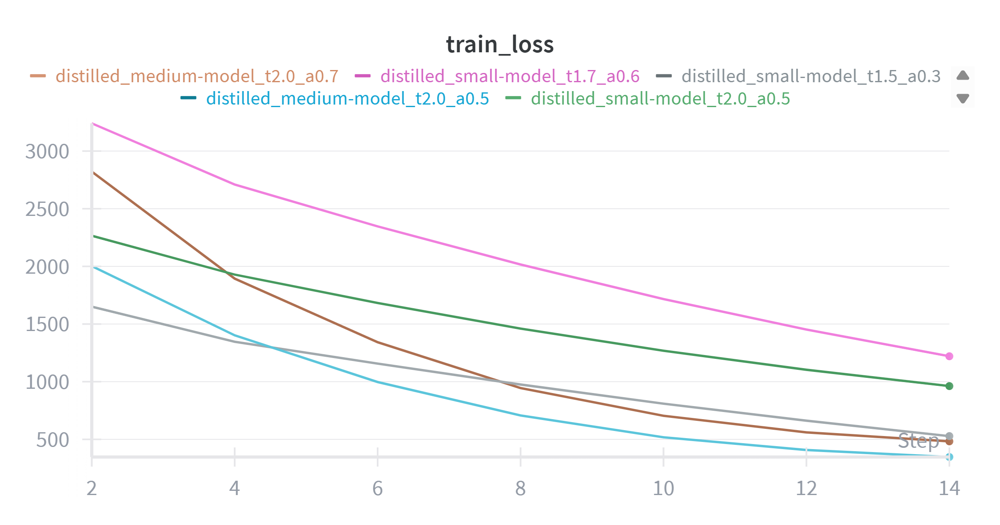
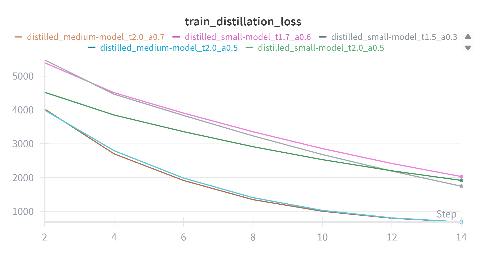
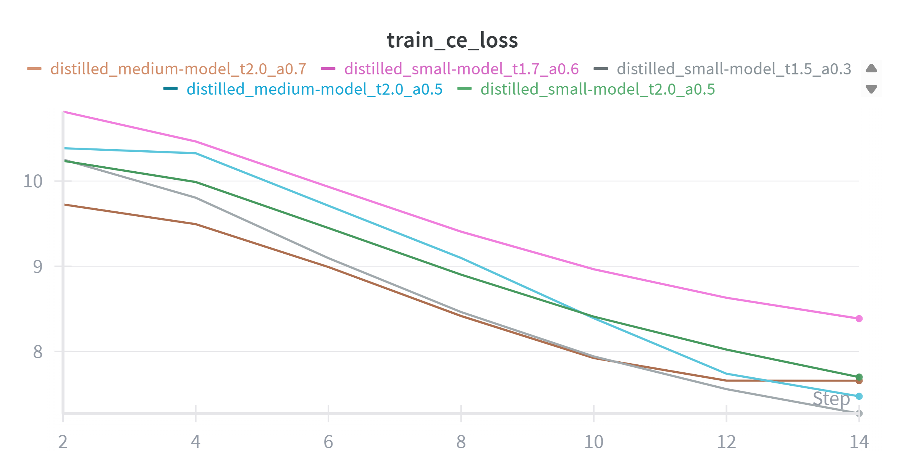
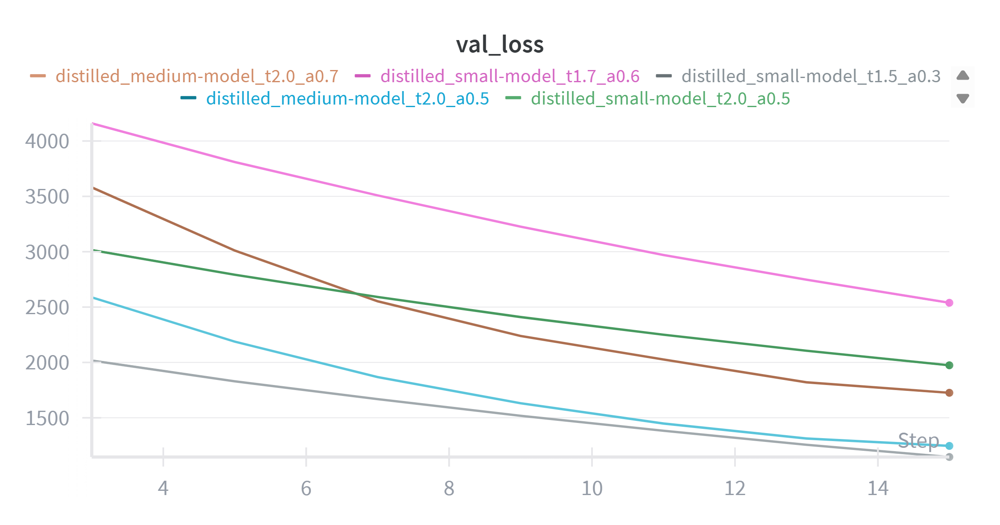
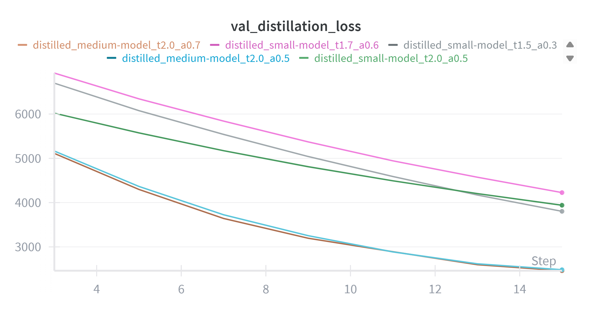
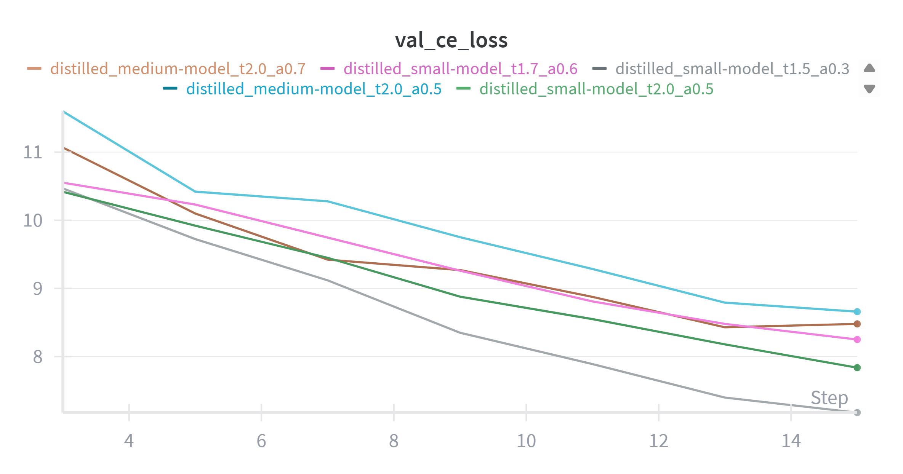

# Coding AI model distillation

## Introduction
A code generation AI model using knowledge distillation. 
- The teacher model will be a large pre-trained model (e.g., StarCoder or a similar open-source code model), which has been trained on massive datasets like StarCoderData.
- The student models are smaller models built from scratch and trained via distillation to mimic the teacher, making them more efficient in terms of size, inference speed and compute requirements while maintaining reasonable performance.

The distillation process related to transfer knowledge from the teacher (soft probabilities over token predictions) to the student and often leading to better generalization than training the student on raw data alone. 

It demonstrates *how distillation can produce lightweight models suitable for deployment in resource-constrained environments*.

## My approach
Use a pre-trained model from Hugging Face (*bigcode/starcoder2-3b, ~3B parameters*) as the teacher model.

Student models with a small to medium transformer (*~44M* and *~202M parameters* and *GPT2-like* architecture) built from scratch using PyTorch.

Efficiency proof by comparing model size, inference latency and benchmark scores (Pass@1/Pass@10 on HumanEval subset, BLEU on generated code similarity).

*Tools*:
  - Hugging Face Transformers/Datasets for model handling and data loading.
  - PyTorch for custom training and distillation.
  - Weights & Biases (W&B) for experiment tracking and logging.
  - Evaluate library for metrics.
 
## Dataset

| **Name** | **Features** | **Number of rows** | **Description** | **Purpose** |
| --- | --- | --- | --- | --- | 
| google-research-datasets/mbpp (full) | `task_id`, `text`, `code`, `test_list`, `test_setup_code`, `challenge_test_list` | 374 | MBPP (Mostly Basic Python Problems) dataset for training code generation models. Problems are simple Python tasks with descriptions, solutions and tests | Training | 
| openai/openai_humanevel | `task_id`, `prompt`, `canonical_solution`, `test`, `entry_point`| 164 | HumanEval benchmark for code generation, consisting of Python programming problems with unit tests. Used for Pass@k evaluation | Evaluation |

## The teacher model
- StarCoder2-3B (pre-trained on code).
- Use bfloat16 for efficiency and auto device mapping.
- Set to eval mode for inference (soft labels in distillation).
```markdown
Starcoder2ForCausalLM(
  (model): Starcoder2Model(
    (embed_tokens): Embedding(49152, 3072)
    (layers): ModuleList(
      (0-29): 30 x Starcoder2DecoderLayer(
        (self_attn): Starcoder2Attention(
          (q_proj): Linear(in_features=3072, out_features=3072, bias=True)
          (k_proj): Linear(in_features=3072, out_features=256, bias=True)
          (v_proj): Linear(in_features=3072, out_features=256, bias=True)
          (o_proj): Linear(in_features=3072, out_features=3072, bias=True)
        )
        (mlp): Starcoder2MLP(
          (c_fc): Linear(in_features=3072, out_features=12288, bias=True)
          (c_proj): Linear(in_features=12288, out_features=3072, bias=True)
          (act): PytorchGELUTanh()
        )
        (input_layernorm): LayerNorm((3072,), eps=1e-05, elementwise_affine=True)
        (post_attention_layernorm): LayerNorm((3072,), eps=1e-05, elementwise_affine=True)
      )
    )
    (norm): LayerNorm((3072,), eps=1e-05, elementwise_affine=True)
    (rotary_emb): Starcoder2RotaryEmbedding()
  )
  (lm_head): Linear(in_features=3072, out_features=49152, bias=False)
)
```

## The student models

*Student models*
| **Name** | **Architecture** | **#Params** | **#Layers** | **#Embeddings** | **#Heads** | **#Positions** | 
| --- | --- | --- | --- | --- | --- | --- |
| model_44m_t1.5_a0.3 | GPT2-like | 44M |  6 | 512 | 8 | 512 | 
| model_44m_t1.7_a0.6 | GPT2-like | 44M | 6 | 512 | 8 | 512 | 
| model_44m_t2.0_a0.5 | GPT2-like | 44M | 6 | 512 | 8 | 512 |    
| model_202m_t2.0_a0.5 | GPT2-like | 202M | 12 | 1024 | 16 | 512 |
| model_202m_t2.0_a0.7 | GPT2-like | 202M | 12 | 1024 | 16 | 512 | 

*Hyperparameters*
| **Name** | **Temperature** | **Alpha** | **Epochs** |  
| --- | --- | --- | --- |
| model_44m_t1.5_a0.3 | 1.5 | 0.3 | 7 | 
| model_44m_t1.7_a0.6 | 1.7 | 0.6 | 7 | 
| model_44m_t2.0_a0.5 | 2.0 | 0.5 | 7 |
| model_202m_t2.0_a0.5 | 2.0 | 0.5 | 7 |  
| model_202m_t2.0_a0.7 | 2.0 | 0.7 | 7 |

## Training and evaluation setup
*Training*
- The DataLoaders shuffle the training dataset but not evaluation dataset.
- Temperature softens logits for distillation, while alpha balances KL divergence (distillation loss) and cross-entropy (hard label loss).
- *Loop over hyperparameters and students* by training with KL div + CE, logging metrics (losses, time) to W&B and saving models.
- Gradient accumulation (steps=4) to handle memory constraints and optimizer is AdamW with lr=5e-5.

*Evaluation*
- Init Weights & Biases (W&B) for eval logging/tracking.
- On the metrics of code_eval for Pass@k (code correctness), BLEU for code similarity to canonical solutions.
- Compare teacher and students on params, Pass@1/10, BLEU, latency (avg over 20 generations).

## Results
*Summary*
| Model | Params (M) | Pass@1 | Pass@10 | BLEU | Avg Latency (s) | File size (.safetensors in MB) |
| --- | --- | --- | ---- | --- | --- | --- | 
| Teacher model (StarCode2-3B) | 3030.371 | 0.05 (avg) | 0.52 (avg) | 0.007923 (avg) | 5918.748 |
| model_202m_t2.0_a0.5 | 202.013 (~0.067x) | 0.8  | 1 | 0.01424 | 4.725 | 789.127 (~0.133x) | 
| model_202m_t2.0_a0.7 | 202.013 (~0.067x) | 1 | 0.95 | 0.008332 | 4.926 | 789.127 (~0.133x) |
| model_44m_t1.7_a0.6 | 44.343 (~0.015) | 0.5 | 0.95 | 0.01512 | 2.489 | 173.224 (~0.029x) |
| model_44m_t1.5_a0.3 | 44.343 (~0.015) | 0.95 | 0.95 | 0.01677 | 2.478 | 173.224 (~0.029x) |
| model_44m_t2.0_a0.5 | 44.343 (~0.015) | 1 | 0.9 | 0.02144 | 2.491 | 173.224 (~0.029x) |

*Training loss*

| Training Loss | Training Distillation Loss | Training CE Loss |
|---------------|----------------------------|------------------|
|  |  |  |

*Evaluation loss*
| Evaluation Loss | Evaluation Distillation Loss | Evaluation CE Loss |
|---------------|----------------------------|------------------|
|  | |  |

## Discussion and Insights
***Training process***

The combination of KL divergence (mimicking teacher's soft predictions) and CE loss led to stable convergence. Higher temperatures (e.g., 2.0) softened distributions more, aiding generalization in students. Alpha=0.5 balanced soft/hard losses effectively. Losses decreased consistently over 7 epochs, with distillation loss dominating initially and CE loss refining later and gradient accumulation helped with memory on Kaggle GPUs.

Small dataset (374 examples) risked overfitting and larger datasets could improve robustness but the training time per epoch can be ~5-10 minutes for 44M models, longer for 202M and also cause full memory and died kernel.

***Evaluation process***

Full HumanEval (164 problems) would provide more reliable metrics. Teacher's low Pass@1 (0.05) and benchmarks (~30-35% on full HumanEval) suggests prompt format or subset difficulty affected scores.

Students achieved high Pass@1 (0.5-1.0) on the subset, outperforming the teacher, likely due to distillation focusing on task-specific patterns. BLEU scores (0.008-0.021) indicate reasonable code similarity, though low overall due to creative code variations.

***Overall***
Distillation successfully compressed knowledge into efficient students with trade-offs in generalization on small evals. Tune alpha for task balance and scale datasets for better results.

## Limitations

- Small eval subset may inflate student scores.
- No fine-tuning on diverse languages (Python-focused).
- Compute-limited, larger teachers/students could yield better results.